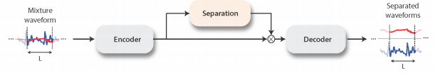
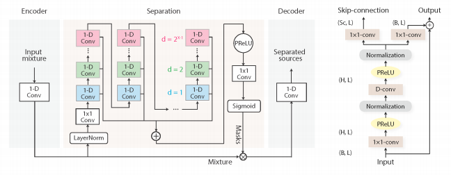

# ConvTasNet

**Link to paper** : [link](https://arxiv.org/abs/1809.07454)

The problem is modeled as a speech separation task to individually identify the primary speaker and the background noise. This ensures that the denoised samples do not contain the background noise and vice versa as the model is trained to distinctly identify both of them. 

**High Level overview**

- Model consists of an Encoder, Separation module and Decoder.
- The Encoder uses the mixture waveform as input and transforms it to an N-dimensional representation. 
- The Separation Module generates masks which are then multiplied with the encoded input to produce individual sources that make up the mixture. 
- The above produced representation for each source is passed to the Decoder to produce the separated audio sources. 

**Model in Detail**

- The model is composed of Convolutional 1D blocks which captures the temporal features and Residual connections which retains the spatial information from one block to another. 
- The separation module consists of  stacked convolutional blocks with increasing dilations whose outputs are summed together using skip connections. 
- Standard Convolutional blocks are replaced with Depth-wise separable convolutions that decouples into depth-wise and point-wise convolution operations. Both these above measures reduce the number of operations. 
- Causal Convolutional blocks are used to model a real-time usage scenario which does not allow the layer to look ahead more than a specific amount of time (done by shifting the input).  
- Finally to stabilize the dynamics of the input, a Cumulative Layer Normalisation is used because in a causal configuration the model cannot use the future values of the signal at any time step. 

**Loss function and Training objective**

- The model is trained to maximise the SI-SNR (Scale-invariant source to noise ratio) metric which is often used to evaluate speech separation models. The loss function is defined as the negative of the above metric. 
- Here we need not ensure PIT (Permutation Invariant Training) as we need to recognise the order of the decoded samples as noise or clean.