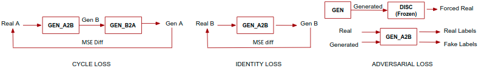

# Cycle GANs

**Basic Idea**

Our idea was to do denoising using non-parallel noisy and clean audio files meaning we dont have the clean files corresponding to every noisy file. First thing that came to our mind was a cycle GAN but on further thought we realised that this doesn't make sense as the clean output cannot be converted to its noisy realisation as the noise is random and can be anything. We had some thoughts on how to overcome this (maybe by giving an encoding of the noisy input) but we didnt spend much time on it. Still I do believe this model can be used for non-parallel voice conversion. 

Just like every other Cycle GAN we have two generators, one to map from domain A to B and another B to A. Similarly we have two discriminators each for domain A and domain B. The model is trained via three losses - adversarial, identity and cycle loss. 

**Modifications to the Vanilla Cycle GAN:**

**Generator:**

- A 1D CNN is more suitable to capture the overall relationship while a 2D CNN is better suited for converting features while preserving the original structures. Hence to make use of both these properties, the generator consists of a 2D CNN, followed by a 1D CNN and then a 2D CNN again. 
- Audio and speech have sequential and hierarchical structures and hence a Gated CNN is used which comprises two CNNs and their outputs are passed through a GLU operation. This operation helps selectively propagate information to the next layer as shown in the paper [link](https://arxiv.org/abs/1612.08083)

**Discriminator:**

- Often in GANs, the discriminator predicts a single value to determine the real/fakeness of the input which often doesn’t work well unless we have a lot of layers. Hence, the modified discriminator outputs a matrix (patch) which determines which parts of the input/output is real/fake hence providing more receptive information. [link](https://arxiv.org/pdf/1611.07004.pdf)

**Adversarial Loss:**

- The adversarial loss is applied twice, once while conversion from A to B individually and another after the conversion back to the starting domain while calculating the cycle loss. 