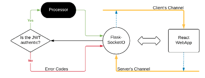
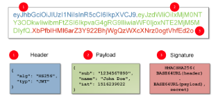
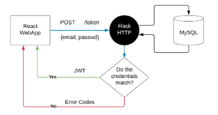

# React + Flask Web App

**Flask + SocketIO**

It is essential for a deployment of a Deep Learning Model to be both scalable and extensible. A client-server model is proposed to demonstrate the same.

- The server is stateless and relies on WebSocket connections for audio data exchanges.
- Stateless : A server that doesn’t handle user sessions; Such server programs provide high amount of hosting flexibility. 
- WebSocket : A low-latency data transport layer; Socket connections are persistent & bidirectional, in contrast to HTTP requests and therefore, have less overhead when exchanging data. SocketIO is used which was initially a JavaScript library for handling WebSocket communications and now is present in Python and few other high level languages also.
- The client is a React Web-App which has functionalities of recording/playing audio, socketio-client to connect with server, etc.
- The audio is transmitted from/to the client in the form of a Blob, which is nothing but a binary form of raw audio data. 

**JWTs**

- JWT stands for JSON Web Token. A n-sized string which can authenticate users. A cryptographic proof that the holder is our customer.
- The best analogy of a JWT is a hotel key; We register at front-desk, get a piece of plastic which can open your room ( and not others’ ) and when our stay ends, it becomes useless ( expired ). 

Coming back to reality, JWT consists of three parts : Header, Payload, Signature.

- Header contains information about the cryptographic algorithm used to sign. 
- Payload contains basic user information. ( IMP : should contain very less information )
- Signature is the most important part : this part ensures the credibility of the token. When creating a JWT, the algorithm feeds on header and payload , adds some other magic and creates the Signature. When the JWT is checked, the Signature is checked by the algorithm and authentication is done. 

**Socket Communications**

Sockets work on a “event”- based system. The client and server listen to events and respond appropriately. A client executes a server’s event and vice versa.
Analogy time!  We can think of events as Channels of data. Execution can be seen as pushing of data into the receiver’s channel.
 
- React app records audio , “blobs” it and pushes an object ( blob + JWT ) into the server’s channel.
- Server first verifies the JWT and if it is legit, processes the blob. 
- Deep Learning model lies in the Processor and does its job beautifully; returning the “clean” audio data.
- Server then converts the audio to a Blob and pushes it to client’s channel.
- Client receives and plays the audio :)

