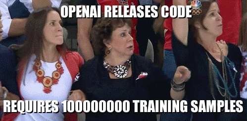
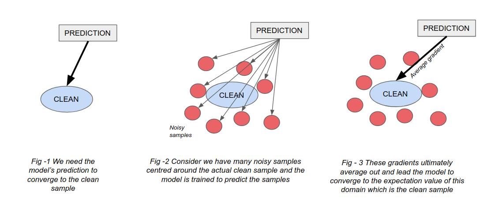

# Unsupervised Denosing

**Why do we need unsupervised models?**

- Generally, supervised approaches benefit from training on huge corpuses of data and give SOTA results. A major assumption in Deep Learning models is the availability of ground truth data while training.
- Speech Denoising is more challenging due to the fact that generating clean speech samples is very difficult and requires complicated experimental setups and human resources (for narration). 
- Due to the presence of infinite noisy samples, unsupervised models can generalise better to multiple types of primary-speaker profiles and noises. 

**So what is this?**

- Completely unsupervised training and utilises just noisy samples for training to generate enhanced waveforms.
- Can also be used to fine tune any pre-trained supervised models to the available noisy data to improve results as it is not model-specific.

**The idea and why does it work?**

Essentially, the model is given a noisy realisation of a speaker A and trained to predict another noisy realisation of the same speaker. This might seem to be counterintuitive from what we are typing to do which is predict the clean samples. But this idea can be seen in Nvidia’s [noise2noise paper](https://arxiv.org/abs/1803.04189) where they perform unsupervised denoising of images. 

- Lets assume a latent space of all audio samples where we have our clean speaker A at the center and corresponding noisy realisations of the same lie around it by some offset. 
- In a supervised training scheme, gradients are computed by calculating the loss between the model’s prediction and the clean sample (fig - 1)
- Instead if the model’s targets are noisy samples, the average of all of these gradients will lead the model to converge towards the actual clean sample itself (i.e) converge to the expectation of these noisy targets which is the clean sample. (fig-2, fig-3)
- The model is trained with sufficiently large number of noisy samples, then it would converge to the same optimum as in the supervised case.
- To conclude, in a statistical point of view, in the case of conflicting samples the cost function would acquire the least value at the mean. 

**Implementation**

- To validate our approach, a simple U-Net model with convolutional encoder and decoder with a LSTM bottleneck layer is trained on noisy samples. Note: The model is never exposed to clean samples. 
- It is trained to minimise the L1 loss between the predicted waveform and target noisy realisation which converges to clean samples eventually.

